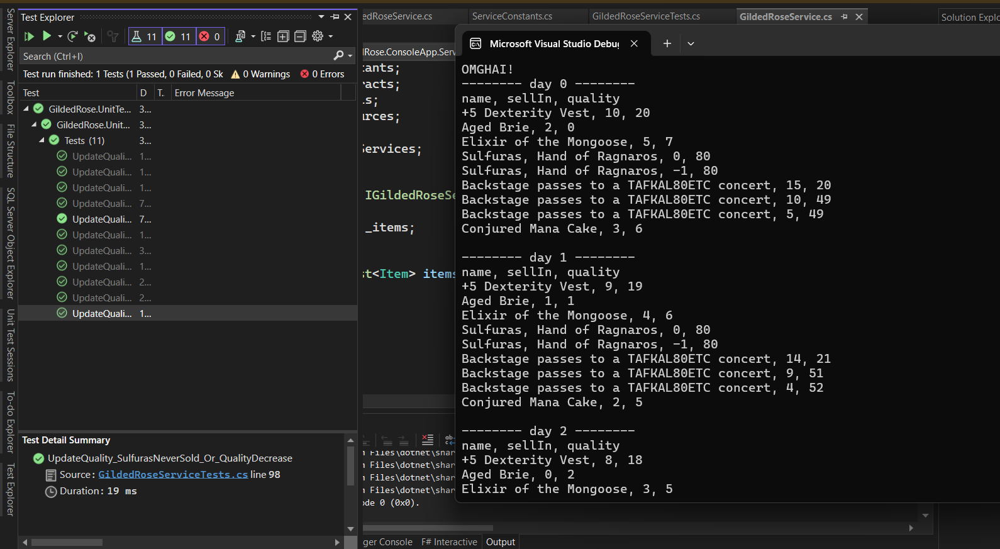

# Gilded Rose Refactoring Kata C#

## Code refactoring and new features

## Architecture
1. The project is divided into two parts: the main program as a console application and unit tests as a separate project. While it could have been possible to extract the main service and calculation algorithm into a separate library, it seemed a bit excessive in this case.
2. Both projects are implemented using .NET 8.
3. All classes and files are organized into appropriate directories at the root of the project for better navigation.
4. Unit tests are implemented to cover all necessary scenarios.

## Refactoring
1. All string literals are extracted into resources to allow for scalability, future changes, and potential localization. Although constant values could have been used, utilizing resources provides better flexibility.
2. All magic numbers in the algorithm, as well as some important constants as per the requirements, are extracted into a separate dedicated class for convenience.
3. An interface is defined for the main service to facilitate better testing, dependency injection, and scalability of the application.
4. Modern syntax features such as body expressions, constructor initialization, and collection initialization are employed for readability and conciseness.
5. The main algorithm undergoes significant refactoring, including the extraction of methods for state-checking, code block optimization, and overall improvement in code readability.

## Appearance:

 

## Running the Code
To run the code, clone the repository and open the project in Visual Studio 2022. Compile and run the project from within the IDE.

Feel free to reach out if you have any questions or need further assistance!
